# Deep-Learning-for-Surgical-Video-Analysis
基于深度学习的手术视频分析算法
以下是将训练文档内容整理成的**完整、美观、结构清晰**的 GitHub README 文件 Markdown 代码：

```markdown
# 🧠 Surgical Phase Anticipation Pipeline

> 基于 SegFormer + MS-TCN + Transformer 的多阶段手术阶段预测模型训练框架

## 📁 项目结构概览

```
code_80/
├── train_evp.py            # 第一阶段：主干网络训练
├── finetune_evp.py         # 第二阶段：主干网络微调
├── generate_evp_LFB.py     # 特征提取与存储
├── tecno.py                # MS-TCN 训练
├── tecno_trans.py          # Transformer 训练
└── trans_SV_output.py      # 验证/测试集推理预测

data/cholec80/
├── phase_anticipation_annotations/    # 标注文件
└── anticipation_output/               # 输出可视化

bimask_ss_pos/cholec80/     # 训练结果存储
├── stage1_32_8_40/         # 第一阶段结果
├── stage2_40_40/           # 第二阶段结果
│   ├── embedding1/         # SegFormer 参数
│   ├── LFB1/               # 提取的空间特征
│   ├── TeCNO1-2/           # MS-TCN 模型参数
│   ├── TeCNOt1-2/          # Transformer 模型参数
│   └── output/             # 预测结果
└── runs/                   # TensorBoard 日志
```

## 🚀 快速开始

### 1. 环境准备
首先切换到训练环境：

```bash
conda activate my_srtp_env
```

### 2. 主干网络训练（两阶段）

#### 第一阶段训练
```bash
cd /root/autodl-tmp/data/code_80
nohup python train_evp.py --train 88 --val 88 --work 8 > train_log.txt 2>&1 &
```

#### 第二阶段微调
```bash
nohup python finetune_evp.py > finetune_log.txt 2>&1 &
```

#### 查看训练日志
```bash
tail -f train_log.txt      # 第一阶段日志
tail -f finetune_log.txt   # 第二阶段日志
# 按 Ctrl+C 退出查看
```

### 3. 特征提取
使用训练好的 SegFormer 提取特征：

```bash
nohup python generate_evp_LFB.py > generate_LFB_log.txt 2>&1 &
tail -f generate_LFB_log.txt
```

### 4. 时序模型训练

#### MS-TCN 训练
```bash
nohup python tecno.py > tecno_log.txt 2>&1 &
tail -f tecno_log.txt
```

#### Transformer 训练
```bash
nohup python tecno_trans.py > tecno_trans_log.txt 2>&1 &
tail -f tecno_trans_log.txt
```

### 5. 推理预测
加载训练好的模型进行预测：

```bash
nohup python trans_SV_output.py > trans_SV_output_log.txt 2>&1 &
tail -f trans_SV_output_log.txt
```

## 🛠️ 训练流程详解

### 📊 流程概览

```mermaid
graph TD
    A[第一阶段训练<br>SegFormer] --> B[第二阶段微调<br>SegFormer]
    B --> C[特征提取<br>generate_evp_LFB.py]
    C --> D[MS-TCN训练<br>tecno.py]
    D --> E[Transformer训练<br>tecno_trans.py]
    E --> F[推理预测<br>trans_SV_output.py]
    F --> G[输出预测结果]
```



### 一、主干网络训练（SegFormer）

**目标**：训练 SegFormer 作为特征提取器

- **第一阶段**：基础训练
- **第二阶段**：微调优化
- **输出位置**：`bimask_ss_pos/cholec80/stage1_32_8_40/embedding1/`

### 二、特征提取

**文件**：`generate_evp_LFB.py`

**功能**：使用训练好的 SegFormer 提取视频的空间特征并存储，供后续时序模型使用。

### 三、时序模型训练

#### 1. MS-TCN 训练
- **文件**：`tecno.py`
- **输入**：提取的空间特征
- **输出**：MS-TCN 模型参数（`.pth` 文件）
- **示例输出**：`TeCNOevp_epoch_15.pth`

#### 2. Transformer 训练
- **文件**：`tecno_trans.py`
- **输入**：空间特征 + MS-TCN 输出特征
- **输出**：Transformer 模型参数（`.pth` 文件）
- **示例输出**：`TeCNOevp_trans1_3_5_1_length_30_epoch_1_train_9780_val_9210.pth`

### 四、推理预测

**文件**：`trans_SV_output.py`

**功能**：加载训练好的 MS-TCN 和 Transformer 模型，对验证集和测试集进行预测，生成最终结果。

## 📂 数据与标注说明

### 标注文件格式
`data/cholec80/phase_anticipation_annotations/`

- **格式**：二维矩阵
- **行**：视频的每一帧（按时间顺序）
- **列**：7个手术阶段
- **数值含义**：
  - `0`：当前正在进行该阶段
  - `>0`：归一化后的倒计时数值（0~1），表示距离该阶段发生的时间

### 输出可视化
`data/cholec80/anticipation_output/`

- **内容**：包含7个子图的大图，每个子图对应一个手术阶段
- **X轴**：帧数（时间）
- **Y轴**：距离下一阶段发生的时间（分钟）
- **红色曲线**：Ground Truth 信号（锯齿状波形）

## 🔧 监控与调试

### TensorBoard 可视化
```bash
tensorboard --logdir="D:\srtp\dataset\code_80\bimask_ss_pos\cholec80\stage1_32_8_40\embedding1\runs"
```

> **注意**：路径需根据本地实际情况调整，在本地已配置好的环境中运行。

### 终止训练进程
1. 查看 GPU 进程：
```bash
nvidia-smi
```
2. 根据显示的 PID 终止进程：
```bash
kill <PID>
```

## 📊 模型文件说明

| 目录/文件 | 说明 |
|-----------|------|
| `stage1_32_8_40/` | 第一阶段训练结果 |
| `stage2_40_40/` | 第二阶段训练结果 |
| `embedding1/` | SegFormer 模型参数 |
| `LFB1/` | 提取的空间特征数据 |
| `TeCNO1-2/` | MS-TCN 模型参数 |
| `TeCNOt1-2/` | Transformer 模型参数 |
| `output/` | 验证集和测试集的预测结果 |

## 🔗 各脚本关系详解

### 1. `tecno.py` - 第一阶段训练器
- **角色**：训练基础的 MS-TCN 模型
- **输入**：预提取的视频特征（LFB features）
- **输出**：MS-TCN 模型权重文件
- **关键点**：这是整个流水线的地基，不依赖其他模型文件

### 2. `tecno_trans.py` - 第二阶段训练器
- **角色**：训练 Transformer 模型
- **输入**：视频特征 + MS-TCN 的输出
- **依赖**：需要先训练好 `tecno.py` 生成的 MS-TCN 模型
- **输出**：Transformer 模型权重文件

### 3. `trans_SV_output.py` - 推理生成器
- **角色**：加载完整模型进行预测
- **输入**：视频特征 + MS-TCN 权重 + Transformer 权重
- **依赖**：需要前两个阶段训练好的模型
- **输出**：最终的预测结果文件

## 📝 代码示例

### 模型加载示例
```python
# 加载 MS-TCN 参数
model = mstcn.MultiStageModel_S(mstcn_stages, mstcn_layers, mstcn_f_maps, 
                                mstcn_f_dim, out_features, mstcn_causal_conv)
model_path = 'bimask_ss_pos/cholec80/stage2_40_40/TeCNO1-2/'
model_name = 'TeCNOevp_epoch_15'
model.load_state_dict(torch.load(model_path + model_name + '.pth'))

# 加载 Transformer 参数
model1 = Transformer(mstcn_f_maps, mstcn_f_dim, out_features, sequence_length)
model1_path = 'bimask_ss_pos/cholec80/stage2_40_40/TeCNO_t1-2/'
model1_name = 'TeCNOevp_trans1_3_5_1_length_30_epoch_1_train_9780_val_9210.pth'
model1.load_state_dict(torch.load(model1_path + model1_name))
```

## ⚠️ 注意事项

1. **训练顺序**：必须按照 `主干网络 → 特征提取 → MS-TCN → Transformer → 推理` 的顺序执行
2. **环境配置**：确保在正确的 conda 环境中运行所有命令
3. **路径适配**：TensorBoard 路径和模型加载路径需根据实际环境调整
4. **日志监控**：使用 `tail -f` 命令实时监控训练进度
5. **模型选择**：选择验证集性能最好的 epoch 对应的模型文件进行后续训练和推理

